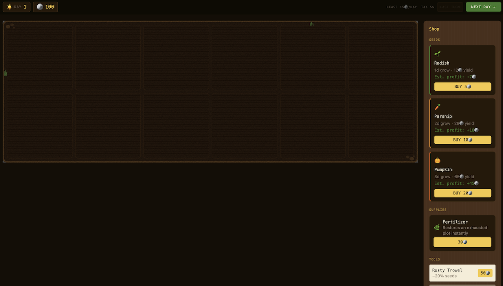
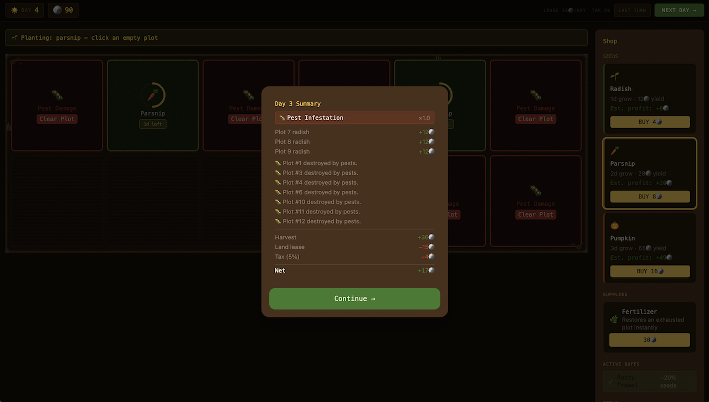
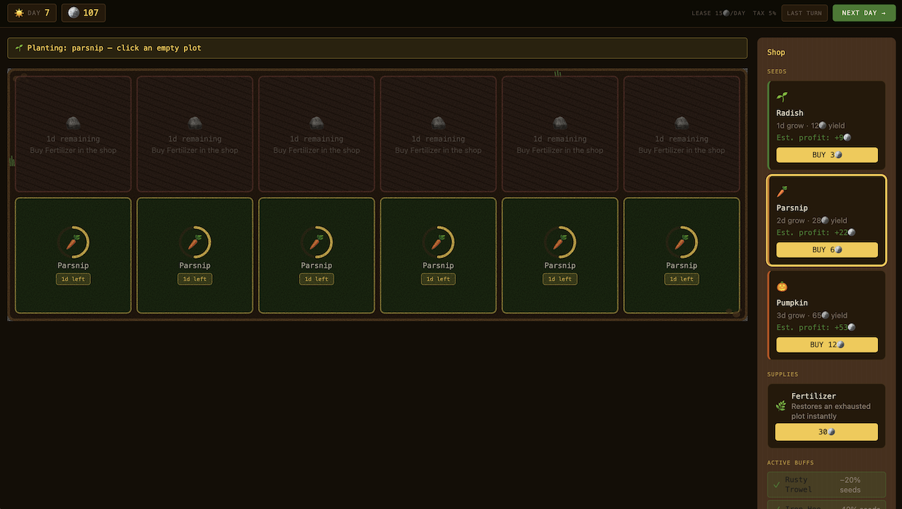

# Pixel Parsnips

Pixel Parsnips is a web-based, turn-based farming tycoon game. Plant seeds, advance days, manage costs, and survive volatile weather while keeping your farm productive. The game emphasizes a visual farm grid, a HUD-driven loop, and a shop for seeds and upgrades.

## Gameplay Overview

- Buy seeds in the shop and plant them on empty plots.
- Advance time with "Next Day" to grow crops and trigger daily events.
- Harvested crops add coins; land lease and tax are deducted each day.
- Plots can become exhausted after repeated harvests and must recover or be fertilized.
- Random weather includes positive boosts and disaster-class events that can reduce yields, destroy crops, or slow growth.

## Key Features

- Turn-based plant → grow → harvest loop with daily costs and bankruptcy condition.
- Visual plot states for empty, growing, ready-to-harvest, exhausted, and pest-damaged plots.
- Shop system for seeds, fertilizer, and tool upgrades that reduce seed prices.
- Weather system with multipliers and disaster events (Blight, Pest Infestation, Flash Drought).
- Responsive UI with a HUD (day, balance, costs, next day) and a mobile bottom-sheet shop.
- Persistent session state using browser localStorage.

## Tech Stack

- React 18 + TypeScript
- Vite 5
- Tailwind CSS 3
- Vitest + Testing Library
- ESLint + Prettier

## Getting Started

```bash
npm install
npm run dev
```

Open the local dev URL printed by Vite (typically `http://localhost:5173`).

## Common Scripts

- `npm run dev` — start the dev server
- `npm run build` — type-check and build for production
- `npm run preview` — preview the production build locally
- `npm run lint` — run ESLint
- `npm test` — run the test suite once
- `npm run test:watch` — run tests in watch mode
- `npm run test:coverage` — run tests with coverage

## Persistence

Game state is saved to localStorage under the key `pixel-parsnips-state` (schema version 3). To reset the game, clear that key in your browser storage.

## Project Structure

- `src` — game UI, state, and logic
- `tests` — test suite
- `specs` — feature specifications and contracts

## How to Play

- Select a seed in the shop, then click an empty plot to plant.
- Click `Next Day` in the HUD to advance time and process the turn.
- Watch the Day Summary modal to see weather, income, and costs.
- Harvest happens automatically when crops mature.
- Use Fertilizer on exhausted plots or wait for them to recover.
- Clear pest-damaged plots before replanting.

## Screenshots

Add images to the `public` folder and update the paths below.





## License

MIT License. See `LICENSE`.
